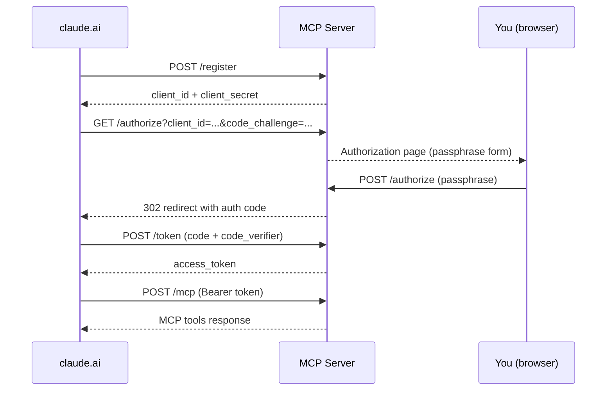

# mcp-github-server

A minimal MCP server that gives Claude read access to your GitHub repositories — directly from claude.ai conversations.

Claude's web interface has no native access to GitHub repositories. This server bridges that gap: connect it to claude.ai as a custom connector and Claude can read any repository included in your GitHub token — public or private — directly from the conversation.

> **Intended for use with claude.ai (web/desktop).** Claude Code and Cowork already have filesystem access and don't need this.

## How it works

## Tools

| Tool | Description |
|------|-------------|
| `list_contents` | List files and folders at a path in a repository |
| `get_file` | Read the decoded content of any file |
| `list_branches` | List all branches in a repository |
| `list_commits` | List recent commits on a branch |
| `get_commit` | Get details of a specific commit |
| `search_code` | Search for code across a repository |

> **Note:** `search_code` relies on GitHub's search index, which may not be built for small private repos. For those cases, use `get_file` directly instead.

## Prerequisites

- Python 3.11+
- A GitHub fine-grained personal access token scoped to the repos you want Claude to access (Contents: read-only) — create one at [github.com/settings/tokens](https://github.com/settings/tokens)
- A [Railway](https://railway.app) account for deployment

## Environment variables

| Variable | Description |
|----------|-------------|
| `GITHUB_TOKEN` | Your fine-grained GitHub PAT |
| `OWNER_PASSPHRASE` | A passphrase you choose — required to authorize claude.ai |
| `BASE_URL` | Your Railway deployment URL (e.g. `https://your-app.up.railway.app`) |
| `DB_PATH` | Path for the SQLite database (default: `oauth.db`) |
| `PORT` | Port to listen on (default: `8000`) |

## Deploy to Railway

1. Fork this repo
2. Create a new project in Railway and connect your fork
3. Set the environment variables above in Railway's variable settings
4. Railway will detect `railway.toml` and deploy automatically
5. Copy your Railway deployment URL and set it as `BASE_URL`

## Connect to claude.ai

1. Go to claude.ai → Settings → Connectors → Add custom connector
2. Enter your Railway URL: `https://your-app.up.railway.app/mcp`
3. Claude will open an authorization page in your browser
4. Enter your `OWNER_PASSPHRASE` and authorize
5. Done — Claude can now read your repositories

## Stack

- [MCP Python SDK](https://github.com/modelcontextprotocol/python-sdk) (FastMCP + StreamableHTTP)
- Starlette + uvicorn
- OAuth 2.1 with PKCE and Dynamic Client Registration — implemented from scratch, no third-party identity provider
- SQLite via aiosqlite for token storage
- httpx for GitHub API calls
- Deployed on Railway

## License

MIT © lola-lew
